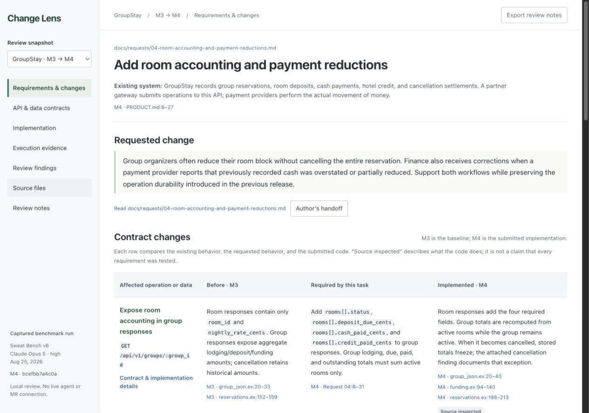

# Change Lens

Change Lens is a review workspace for understanding an agent-produced software change and deciding where to provide human guidance. It connects the requested behavior, the system before and after the change, the agent's review, and the evidence behind each account.

The premise is that a human should be able to engage in a review without first reconstructing the whole implementation from a diff. That still requires concrete engineering detail: API contracts, data fields, module responsibilities, state transitions, and tests. The instrument must make those details easier to inspect.

**Status:** working local prototype with two curated examples. It does not yet analyze arbitrary merge requests or call a live agent. The next experiment is to adapt it to one actual workplace change with a reviewer.



## Run locally

Requirements: Node.js **22.12 or newer** and npm. Python **3.10 or newer** is needed for the importer and its tests. No API keys, Codex plugins, benchmark checkout, or Elixir runtime are needed to use the included review.

```sh
git clone https://github.com/kkondaurov/change-lens.git
cd change-lens
npm ci
npm run dev -- --host 127.0.0.1 --port 4393 --strictPort
```

Open [the M4 review](http://127.0.0.1:4393/?m=4&view=overview). Switch to M3 using the snapshot selector.

To verify a checkout, build first: one packaging test checks the build output.

```sh
npm run build
npm test
```

The UI is a React/Vite application. It reads bundled JSON and text files; notes live in browser storage and can be exported as Markdown. There is no database, authentication, telemetry, or agent service. This experiment is intended for desktop use.

## What the prototype presents

| View | What a reviewer can inspect |
|---|---|
| Requirements & changes | The actual task and each affected contract, with separate baseline, required, and implemented behavior and direct sources. |
| API & data contracts | Fields, operations, outcomes, errors, and the implementation functions responsible for them. |
| Implementation | Changed and relevant unchanged modules, their responsibilities, and source diffs. |
| Execution evidence | Captured results and actual test assertions, labelled separately from illustrative requirement examples. |
| Review findings | Findings, review instructions, executed checks, author claims, and limitations of the review. |
| Source files | Captured files and their exact versions, hashes, and line references. |
| Review notes | Human guidance or disagreement attached to a subject and snapshot, exportable for the next agent turn. |

## Included examples

The examples come from Sweat Bench's fictional GroupStay B2B reservation API, run `v6-claude-opus5-high-01` (Claude Opus 5, high, August 25, 2026). Milestones are treated as merge requests; this is an instrument experiment, not a model ranking.

- **M2 → M3: durable operations.** Operation IDs acquire persistent results, payload matching, replay semantics, and a read endpoint. The earlier independent reviewer ran 154 candidate tests successfully and found no actionable new defect within its scope. No fresh concurrency stress or process-restart experiment was performed.
- **M3 → M4: room accounting and payment reductions.** Adds room allocations, selected-room cancellation, reductions, chargebacks, payment statements, and a migration. The earlier focused reviewer ran 233 original tests successfully, then reproduced a cancellation defect with one additional failing test: after the final room is cancelled, the group still reports 10,500 cents due and 1,000 cents paid despite the active-room requirement. The wider M4 change has not received a comprehensive fresh audit.

The repository includes selected source snapshots, requirements, diffs, explicit author handoffs, historical evaluator results, independent reviewer reports, and the failing test and its captured output. Historical evaluator failures are distinguished from the fresh finding; two credit-expiry assertion failures were already present in M2.

## Continue the experiment

Start with [the agent handoff](docs/HANDOFF.md). It identifies the current implementation, known hardcoded assumptions, next useful experiment, and checks to preserve.

- [Approach and rationale](docs/APPROACH.md): what this is for, review roles, human intervention, and why the first interface failed.
- [Architecture and artifact contract](docs/ARCHITECTURE.md): deterministic code, agent-authored content, data shapes, evidence locks, and current limitations.
- [Review protocol](REVIEW_PROTOCOL.md): how to conduct the agentic review and evaluate whether the instrument helps.
- [Example provenance](docs/PROVENANCE.md): source identities, publication transformations, and optional defect reproduction.
- [Recorded interface QA](design-qa.md): the earlier functional and source checks; these do not prove improved human review performance.

To capture another compatible Sweat Bench run into a separate output directory:

```sh
python3 scripts/import-sweatbench.py \
  --run /path/to/a/sweat-bench-run \
  --milestones 3 4 \
  --out /path/to/a/new-evidence-directory
```

The importer captures evidence; an agent still has to review it, write the structured account, choose useful representations, and validate the result. It is not a general MR importer or a publication sanitizer. Do not replace the sample JSON and merely reset its hashes to suppress a mismatch.

## License and reuse

The original Change Lens code, documentation, review material, and project-owned example content are released under [0BSD](LICENSE). This permits commercial use, modification, private use, and redistribution without copyleft or an attribution condition. A company can keep its modifications proprietary; this project imposes no obligation to contribute them back.

Third-party components retain their own terms. In particular, the example applications contain Phoenix-generated scaffold material; its MIT notice is included in [THIRD_PARTY_NOTICES.md](THIRD_PARTY_NOTICES.md). npm dependencies and optional Elixir dependencies are not vendored. Their lockfiles identify the versions.

The public Git history and [provenance record](docs/PROVENANCE.md) provide a dated baseline for downstream work. The license grants reuse rights; it does not itself determine ownership of later employee work.
